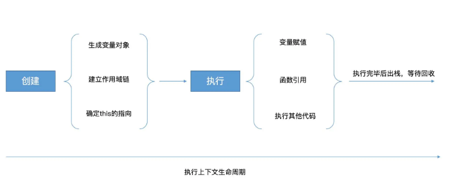

## 一. 执行上下文(基础概念)

### (1) 什么是执行上下文？
Javascript 代码都是在执行上下文中运行的；
执行上下文： 指当前执行环境中的变量、函数声明、作用域链、this等信息

### (2) 执行上下文生命周期
a.创建阶段
生成变量对象、建立作用域链、确定this的指向

b.执行阶段
变量赋值、函数的引用、执行其他代码



### (3) 全局、函数、Eval执行上下文
执行上下文分为全局、函数、Eval执行上下文
a.全局执行上下文（浏览器环境下，为全局的 window 对象）
b.函数执行上下文，每当一个函数被调用时, 都会为该函数创建一个新的上下文
c.Eval 函数执行上下文，如eval("1 + 2")
对于每个执行上下文，都有三个重要属性：<font background-color=#fff5f5 color=#ff502c size=2>变量对象、作用域链(Scope chain)、this</font>

### (4) 执行上下文的特点：
a.单线程，只在主线程上运行；
b.同步执行，从上向下按顺序执行；
c.全局上下文只有一个，也就是window对象；
d.函数每调用一次就会产生一个新的执行上下文环境。

## 二. 执行栈
是一种先进后出的数据结构，用来存储代码运行的所有执行上下文
1）当 JS 引擎第一次遇到js脚本时，会创建一个全局的执行上下文并且压入当前执行栈
2）每当JS 引擎遇到一个函数调用，它会为该函数创建一个新的执行上下文并压入栈的顶部
3）当该函数执行结束时，执行上下文从栈中弹出，控制流程到达当前栈中的下一个上下文
4）一旦所有代码执行完毕，JS 引擎从当前栈中移除全局执行上下文

## 三. 变量对象、作用域、this

### 3.this的5种绑定方式：遵循准则，谁调用就指向谁(默认指向全局)
- 默认绑定(非严格模式下this指向全局对象, 严格模式下this会绑定到undefined)
- 隐式绑定(当函数引用有上下文对象时, 如 obj.foo()的调用方式, foo内的this指向obj)
- 显示绑定(通过call()或者apply()方法直接指定this的绑定对象, 如foo.call(obj))
- new绑定()
- 箭头函数绑定(this的指向由外层作用域决定的)

**特殊情况：** 
1. 立即执行匿名函数表达式和定时器(setTimeout)是由window调用的。
2. 使用new构造函数时，其(内部构造函数)this指向的是当前函数的作用域。

#### (1) 默认绑定
##### 题目一
```javascript
var a = 1
function foo () {
  var a = 2
  function inner () { 
    console.log(this.a)
  }
  inner()
}

foo()
复制代码
```

输出结果：1

**解析：**

foo()等同于window.foo()，这里默认是全局，函数内的this指向的是window，inner调用的对象是window，所以this.a是1(var a = 2是函数foo的变量对象，与this是同在执行上下文，互不相关)

##### 题目二
```javascript
console.log(foo);
function foo(){
    console.log("foo");
}
var foo = 1;

复制代码
```

输出结果：打印函数

**解析：**


##### 题目三
```javascript
var foo = 1;
function foo(){
    console.log("foo");
}
console.log(foo);

复制代码
```

输出结果：1

**解析：**

实际上是函数被覆盖了，记住一点：函数提升优先级大于变量。
执行顺序：函数foo提升顶级并定义，变量var foo定义，foo=1赋值覆盖函数foo

#### (2) 隐式绑定

this 永远指向最后调用它的那个对象。谁最后调用的函数，函数内的this指向的就是谁(不考虑箭头函数)。

##### 题目一

```javascript
function foo () {
  console.log(this.a)
}
var obj = { a: 1, foo }
var a = 2
obj.foo()
复制代码
```

输出结果：1

**解析：**
在这道题中，函数foo()虽然是定义在window下，但是我在obj对象中引用了它，并将它重新赋值到obj.foo上。且调用它的是obj对象，因此打印出来的this.a应该是obj中的a。

##### 题目二(特殊)

```javascript
var myObject = {
    foo: "bar",
    func: function() {
        var self = this;
        console.log(this.foo);  
        console.log(self.foo);  
        (function() {
            console.log(this.foo);  
            console.log(self.foo);  
        }());
    }
};
myObject.func();
复制代码
```

输出结果：bar bar undefined bar

**解析：**

- 首先func是由myObject调用的，this指向myObject。又因为var self = this;所以self指向myObject。
- 这个立即执行匿名函数表达式是由window调用的，this指向window 。立即执行匿名函数的作用域处于myObject.func的作用域中，在这个作用域找不到self变量，沿着作用域链向上查找self变量，找到了指向 myObject对象的self。

#### (3) 隐式绑定的隐式丢失问题

> 隐式丢失其实就是被隐式绑定的函数在特定的情况下会丢失绑定对象。

有两种情况容易发生隐式丢失问题：

- 使用另一个变量来给函数取别名
- 将函数作为参数传递时会被隐式赋值，回调函数丢失this绑定

##### 题目一
```javascript
function foo () {
  console.log(this.a)
};
var obj = { a: 1, foo };
var a = 2;
var foo2 = obj.foo;
var obj2 = { a: 3, foo2: obj.foo }

obj.foo();
foo2();
obj2.foo2();  

复制代码
```

> 输出结果：
1
2
3

**解析：**

- obj.foo()中的this指向调用者obj
- foo2()发生了隐式丢失，调用者是window，使得foo()中的this指向window
- foo3()发生了隐式丢失，调用者是obj2，使得foo()中的this指向obj2

##### 题目二
```javascript
function foo () {
  console.log(this.a)
}
function doFoo (fn) {
  console.log(this)
  fn()
}
var obj = { a: 1, foo }
var a = 2
var obj2 = { a: 3, doFoo }

obj2.doFoo(obj.foo)

复制代码
```

> 输出结果：
{ a:3, doFoo: f }
2

**解析：**

如果你把一个函数当成参数传递到另一个函数的时候，也会发生隐式丢失的问题，且与包裹着它的函数的this指向无关。在非严格模式下，会把该函数的this绑定到window上，严格模式下绑定到undefined。

#### (4) 显式绑定

通过call()、apply()或者bind()方法直接指定this的绑定对象, 如foo.call(obj)。
这里有几个知识点需要注意：

- 使用.call()或者.apply()的函数是会直接执行的
- bind()是创建一个新的函数，需要手动调用才会执行
- .call()和.apply()用法基本类似，不过call接收若干个参数，而apply接收的是一个数组

##### 题目一(特殊)
```javascript
var obj1 = {
  a: 1
}
var obj2 = {
  a: 2,
  foo1: function () {
    console.log(this.a)
  },
  foo2: function () {
    setTimeout(function () {
      console.log(this)
      console.log(this.a)
    }.call(obj1), 0)
  }
}
var a = 3
obj2.foo1().call(obj1)
obj2.foo2()  

复制代码
```

> 输出结果：
1
{ a: 1 }
1

**解析：**

- obj2.foo1().call(obj1)使用call改变指向
- 对于setTimeout中的函数，这里存在隐式绑定的隐式丢失，也就是当我们将函数作为参数传递时会被隐式赋值，回调函数丢失this绑定，因此这时候setTimeout中的函数内的this是指向window的。这里通过call改变setTimeout内部函数this指向。
- 为什么不采用 obj2.foo2.call(obj1) 写法？
  如果是这种写法的话，我改变的就是foo2函数内的this的指向了，但是我们知道，foo2函数内this的指向和setTimeout里函数的this是没有关系的，因为调用定时器的始终是window。

##### 题目二
```javascript
function foo () {
  console.log(this.a)
  return function () {
    console.log(this.a)
  }
}
var obj = { a: 1 }
var a = 2

foo()
foo.call(obj)
foo().call(obj)

复制代码
```

> 输出结果：
2
1
2
1

**解析：**

- foo()会正常打印出window下的a，也就是2
- foo.call(obj)由于显式绑定了this，所以会打印出obj下的a，也就是1
- foo().call(obj)开始会执行foo()函数，打印出2
- foo()执行完后，会对foo()函数的返回值执行.call(obj)操作，指向obj，所以是1

##### 题目三
```javascript
var obj = {
  a: 'obj',
  foo: function () {
    console.log('foo:', this.a)
    return function () {
      console.log('inner:', this.a)
    }
  }
}
var a = 'window'
var obj2 = { a: 'obj2' }

obj.foo()()
obj.foo.call(obj2)()
obj.foo().call(obj2)

复制代码
```

> 输出结果：
2
1
2
1

**解析：**

- obj.foo()打印出foo: obj和inner: window，这个没什么疑惑的。
- obj.foo.call(obj2)()打印出foo: obj2 (改变指向) 和 inner: window (最后调用的是window)。
- obj.foo().call(obj2)打印出foo: obj (直接执行，this指向调用者obj) 和 inner: obj2 (改变指向，指向obj2)。

##### 题目四
```javascript
var obj = {
  a: 1,
  foo: function (b) {
    b = b || this.a
    return function (c) {
      console.log(this.a + b + c)
    }
  }
}
var a = 2
var obj2 = { a: 3 }

obj.foo(a).call(obj2, 1)
obj.foo.call(obj2)(1)

复制代码
```

> 输出结果：
6
6

**解析：**

- 开始调用obj.foo(a)将2传入foo函数并赋值给型参b，并且由于闭包的原因，使得匿名函数内能访问到b，之后调用匿名函数的时候，用call()改变了this的指向，使得匿名函数内this.a为3，并传入最后一个参数1，所以第一行输出的应该是3 + 2 + 1，也就是6。
- 而第二行，obj.foo.call(obj2)这里是将foo函数内的this指向了obj2，同时并没有传递任何参数，所以b开始是undefined的，但是又因为有一句b = b || this.a，使得b变为了3；同时最后一段代码(1)，是在调用匿名函数，且和这个匿名函数内的this应该是指向window的，因此输出也为3+2+1，为6。

##### 总结
1. this 永远指向最后调用它的那个对象
2. 匿名函数的this永远指向window
3. 使用.call()或者.apply()的函数是会直接执行的
4. bind()是创建一个新的函数，需要手动调用才会执行
5. 如果call、apply、bind接收到的第一个参数是空或者null、undefined的话，则会忽略这个参数forEach、map、filter函数的第二个参数也是能显式绑定this的

#### (5) new 绑定

> new会构造一个新对象并把这个新对象绑定到调用函数中的this。

##### 题目一(特殊)
```javascript
var obj = { 
  name : 'cuggz', 
  fun : function(){ 
    console.log(this); 
    console.log(this.name); 
  } 
} 
obj.fun()
new obj.fun()
复制代码
```

> 输出结果：
{name: 'cuggz', fun: ƒ}
cuggz
fun {}
undefined

**解析：**

使用new构造函数时，其this指向的是当前函数的作用域。

##### 题目二
```javascript
var name = 'window'
function Person (name) {
  this.name = name
  this.foo = function () {
    console.log(this.name)
    return function () {
      console.log(this.name)
    }
  }
}
var person1 = new Person('person1')
var person2 = new Person('person2')

person1.foo.call(person2)()
person1.foo().call(person2)
复制代码
```

> 输出结果：
'person2'
'window'
'person1'
'person2'

**解析：**

- person1.foo.call(person2)()将foo()函数内的this指向了person2，所以打印出person2，而内部返回的匿名函数是由window调用的，所以打印出window。
- person1.foo().call(person2)是将匿名函数的this显式绑定到了person2上，所以打印出来的会是person2。

#### (6) 箭头函数绑定

对于箭头函数就不是这样咯，它里面的this是由**外层作用域**来决定的，且指向函数定义时的this而非执行时。

> 箭头函数中没有 this 绑定，必须通过查找作用域链来决定其值，如果箭头函数被非箭头函数包含，则 this 绑定的是最近一层非箭头函数的 this，否则，this 为 undefined。

##### 题目一
```javascript
var obj = {
  name: 'obj',
  foo1: () => {
    console.log(this.name)
  },
  foo2: function () {
    console.log(this.name)
    return () => {
      console.log(this.name)
    }
  },
  foo3: function () {
    console.log(this.name)
    return function() {
      console.log(this.name)
    }
  }
}
var name = 'window'
obj.foo1()
obj.foo2()()
obj.foo3()()
复制代码
```

> 输出结果：
'window'
'obj'
'obj'
'obj'
'window'

**解析：**

- obj.foo1()虽然调用指向是obj，但是它的外层作用域是window，对象obj当然不属于作用域了
- obj.foo2()()，首先会执行obj.foo2()，它里面的this是调用它的obj对象，因此打印出obj，然后执行返回的匿名函数，它的this由外层作用域决定，所以打印obj
- obj.foo3()()作为obj.foo2()()对照组，不做解释
 
##### 题目二
```javascript
var name = 'window'
function Person (name) {
  this.name = name
  this.foo1 = function () {
    console.log(this.name)
    return function () {
      console.log(this.name)
    }
  }
  this.foo2 = function () {
    console.log(this.name)
    return () => {
      console.log(this.name)
    }
  }
  this.foo3 = () => {
    console.log(this.name)
    return function () {
      console.log(this.name)
    }
  }
  this.foo4 = () => {
    console.log(this.name)
    return () => {
      console.log(this.name)
    }
  }
}
var person1 = new Person('person1')
person1.foo1()()
person1.foo2()()
person1.foo3()()
person1.foo4()()
复制代码
```

> 输出结果：
'person1' 'window'
'person1' 'person1'
'person1' 'window'
'person1' 'person1'

**解析：**

- person1.foo1()()两层都是普通函数，这个不再重复说了，打印出person1和window。
- person1.foo2()()第一层普通函数，它的this是由最后调用它的对象决定也就是person1，第二层为箭头函数，它的this由外层作用域决定，也就是foo2这个函数，因此也为person1。
- person1.foo3()()第一层为箭头函数，this由外层作用域决定，因此为person1，第二层为普通函数，由最后调用者决定，因此为window。
- person1.foo4()()两层都是箭头函数，this由外层作用域决定，所以都是person1。
 
##### 题目三
```javascript
var name = 'window'
var obj1 = {
  name: 'obj1',
  foo1: function () {
    console.log(this.name)
    return () => {
      console.log(this.name)
    }
  },
  foo2: () => {
    console.log(this.name)
    return function () {
      console.log(this.name)
    }
  }
}
var obj2 = {
  name: 'obj2'
}
obj1.foo1.call(obj2)()
obj1.foo1().call(obj2)
obj1.foo2.call(obj2)()
obj1.foo2().call(obj2)
复制代码
```

> 输出结果：
'obj2' 'obj2'
'obj1' 'obj1'
'window' 'window'
'window' 'obj2'

**解析：**

- obj1.foo1.call(obj2)()第一层为普通函数，并且通过.call改变了this指向为obj2，所以会打印出obj2，第二层为箭头函数，它的this和外层作用域中的this相同，因此也是obj2。
- obj1.foo().call(obj2)第一层打印出obj1，第二层为箭头函数，使用了.call想要修改this的指向，但是并不能成功，因此.call(obj2)对箭头函数无效，还是打印出obj1。
- obj1.foo2.call(obj2)()第一层为箭头函数，并且想要通过.call(obj2)改变this指向，但是无效，且它的外层作用域是window，所以会打印出window，第二层为普通函数，this是最后调用者window，所以也会打印出window。
- obj1.foo2().call(obj2)第一层为箭头函数，外层作用域是window，打印出window，第二层为普通函数，且使用了.call(obj2)来改变this指向，所以打印出了obj2。

##### 题目四
```javascript
var obj = {
   say: function() {
     var f1 = () =>  {
       console.log("1111", this);
     }
     f1();
   },
   pro: {
     getPro:() =>  {
        console.log(this);
     }
   }
}
var o = obj.say;
o();
obj.say();
obj.pro.getPro();
复制代码
```

输出结果：

```javascript
1111 window对象
1111 obj对象
window对象
复制代码
```

**解析：**

- o()，o是在全局执行的，而f1是箭头函数，它是没有绑定this的，它的this指向其父级的this，其父级say方法的this指向的是全局作用域，所以会打印出window；
- obj.say()，谁调用say，say 的this就指向谁，所以此时this指向的是obj对象；
- obj.pro.getPro()，我们知道，箭头函数时不绑定this的，getPro处于pro中，而对象不构成单独的作用域，所以箭头的函数的this就指向了全局作用域window。

##### 总结

- 它里面的this是由外层作用域来决定的，且指向函数定义时的this而非执行时
- 字面量创建的对象，作用域是window，如果里面有箭头函数属性的话，this指向的是window
- 构造函数创建的对象，作用域是可以理解为是这个构造函数，且这个构造函数的this是指向新建的对象的，因此this指向这个对象。
- 箭头函数的this是无法通过bind、call、apply来直接修改，但是可以通过改变作用域中this的指向来间接修改。

#### 综合题

##### 题目一
```javascript
function a(xx){
  this.x = xx;
  return this
};
var x = a(5);
var y = a(6);

console.log(x.x)
console.log(y.x)
复制代码
```

输出结果： undefined  6

**解析：**

1. 最关键的就是var x = a(5)，函数a是在全局作用域调用，所以函数内部的this指向window对象。**所以 this.x = 5 就相当于：window.x = 5。**之后 return this，也就是说 var x = a(5) 中的x变量的值是window，这里的x将函数内部的x的值覆盖了。然后执行var y = a(6)，也就是this.x=6再次将x覆盖，而x是等于6，所以x.x会输出undefined。**如果去掉执行var y = a(6)，那么x.x会打印window对象。**
2. 当指向y.x时，会给全局变量中的x赋值为6，所以会打印出6。

##### 题目二
```javascript
function foo(something){
    this.a = something
}

var obj1 = {
    foo: foo
}

var obj2 = {}

obj1.foo(2); 
console.log(obj1.a); // 2

obj1.foo.call(obj2, 3);
console.log(obj2.a); // 3

var bar = new obj1.foo(4)
console.log(obj1.a); // 2
console.log(bar.a); // 4
复制代码
```

输出结果： 2  3  2  4

**解析：**

1. 首先执行obj1.foo(2); 会在obj中添加a属性，其值为2。之后执行obj1.a，a是右obj1调用的，所以this指向obj，打印出2；
2. 执行 obj1.foo.call(obj2, 3) 时，会将foo的this指向obj2，后面就和上面一样了，所以会打印出3；
3. obj1.a会打印出2；
4. 最后就是考察this绑定的优先级了，new 绑定是比隐式绑定优先级高，所以会输出4。

##### 题目三
```javascript
function foo(something){
    this.a = something
}

var obj1 = {}

var bar = foo.bind(obj1);
bar(2);
console.log(obj1.a);

var baz = new bar(3);// ==》var baz = new foo.bind(3) this含有隐式绑定和new绑定
console.log(obj1.a);
console.log(baz.a);
复制代码
```

输出结果： 2  2  3

这道题目和上面题目差不多，主要都是考察this绑定的优先级。记住以下结论即可：**this绑定的优先级：new绑定 > 显式绑定 > 隐式绑定 > 默认绑定。**